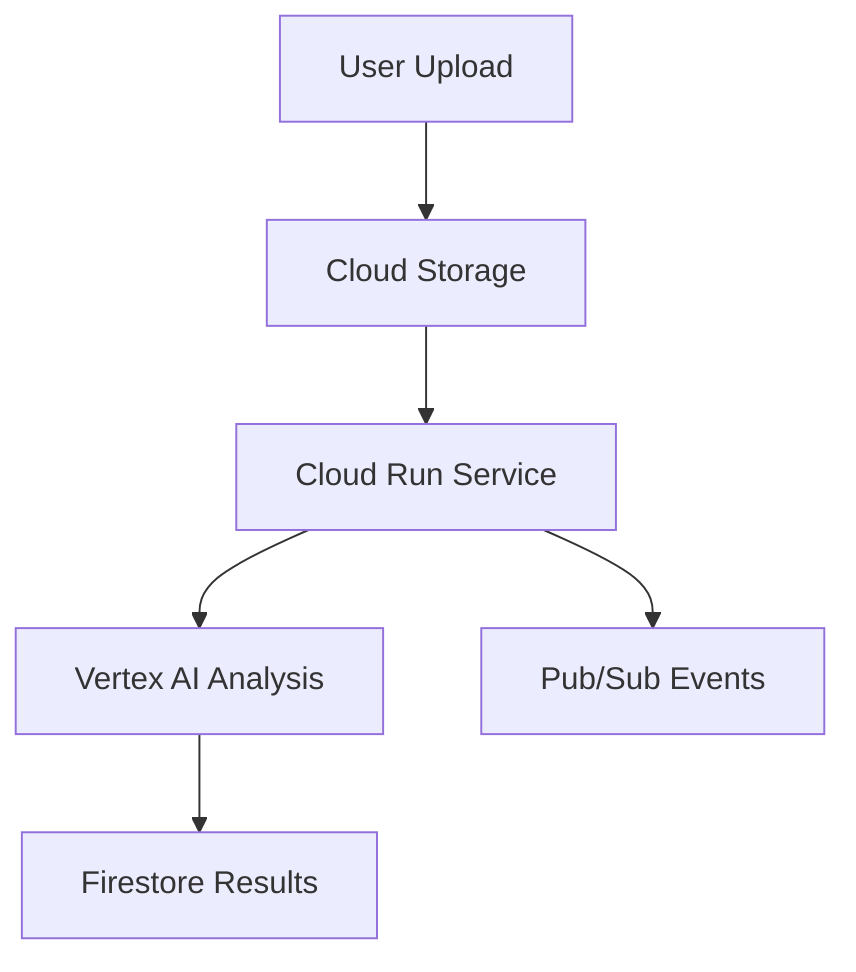

# Video Deal Analyzer

Cloud-native video analysis pipeline using Google Cloud Platform services.

## Quick Start

1. Clone the repository:
```bash
git clone https://github.com/MikeDominic92/Deals4Days.git
cd Deals4Days
```

2. Deploy to GCP:
```bash
./deploy.sh
```

## Features

- Automated video processing pipeline
- Cloud-native architecture using GCP services
- Real-time video analysis with Vertex AI
- Scalable storage with Cloud Storage
- Event-driven processing with Cloud Pub/Sub

## Documentation

- [API Reference](./API.md)
- [Architecture Guide](./ARCHITECTURE.md)
- [Developer Setup](./DEVELOPER.md)

## System Architecture



## Contact

For support or questions, please contact [Mike Dominic](https://github.com/MikeDominic92).
